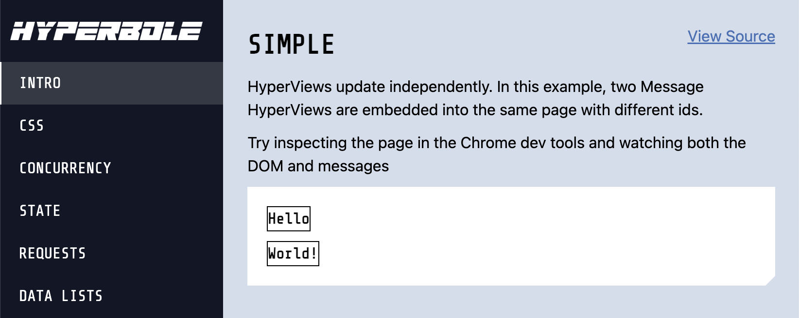

[](https://hackage.haskell.org/package/hyperbole)

Create interactive HTML applications with type-safe serverside Haskell. Inspired by [HTMX](https://htmx.org/), [Elm](https://elm-lang.org/), and [Phoenix LiveView](https://www.phoenixframework.org/)


[hyperbole.live/simple](https://hyperbole.live/simple)

```haskell
{-# LANGUAGE DeriveAnyClass #-}
{-# LANGUAGE OverloadedStrings #-}
{-# LANGUAGE TypeFamilies #-}
module Main where

import Data.Text (Text)
import Web.Hyperbole
import Web.Atomic.CSS


main :: IO ()
main = do
  run 3000 $ do
    liveApp quickStartDocument (runPage page)

page :: (Hyperbole :> es) => Eff es (Page '[Message])
page = do
  pure $ do
    hyper Message1 $ messageView "Hello"
    hyper Message2 $ messageView "World!"

data Message = Message1 | Message2
  deriving (Generic, ViewId)

instance HyperView Message es where
  data Action Message = Louder Text
    deriving (Generic, ViewAction)

  update (Louder msg) = do
    let new = msg <> "!"
    pure $ messageView new

messageView :: Text -> View Message ()
messageView msg = do
  button (Louder msg) ~ border 1 $ text msg
```


Examples
---------

The example directory contains an app demonstrating many features. See it in action at [hyperbole.live](https://hyperbole.live)

<a href="https://hyperbole.live">
  <!---->
  
</a>

<!-- out of date!
* [HaskRead](https://github.com/tusharad/Reddit-Clone-Haskell) - A Reddit Clone
-->

Getting Started with Cabal
--------------------------

Create a new application:

    $ mkdir myapp
    $ cd myapp
    $ cabal init

Add hyperbole and text as dependencies to the `.cabal` file:

```
    build-depends:
        base
      , hyperbole
      , text
```

Paste the above example into Main.hs, and run:

    $ cabal run

Visit http://localhost:3000 to view the application


Learn More
----------

<a href="https://hackage.haskell.org/package/hyperbole/docs/Web-Hyperbole.html" target="_blank">
    <div style="border-radius: 20px; Background-color:#f8f8f8; gap: 20px; display: flex; flex-direction: row; align-items: center">
      <svg xmlns="http://www.w3.org/2000/svg" width="200" height="160" viewBox="0 0 200 160" style="width:200px; flex-shrink:0">
        <g transform="translate(20, 20) scale(10)">
          <path fill="#453a62" d="M 0 12 L 4 6 L 0 0 L 3 0 L 7 6 L 3 12"/>
          <path fill="#5e5086" d="M 4 12 L 8 6 L 4 0 L 7 0 L 15 12 L 12 12 L 9.5 8.25 L 7 12"/>
          <path fill="#8f4e8b" d="M 13.66 8.5 L 12.333 6.5 L 17 6.5 L 17 8.5 M 11.666 5.5 L 10.333 3.5 L 17 3.5 L 17 5.5"/>
        </g>
      </svg>
      <div style="font-size:28px; color:#333; font-weight: bold;">
        View Documentation on Hackage
      </div>
    </div>
</a>


In the Wild
---------------------

<a href="https://nso.edu">
  
</a>

The NSO uses Hyperbole for the Level 2 Data creation tool for the [DKIST telescope](https://nso.edu/telescopes/dki-solar-telescope/). It is completely [open source](https://github.com/DKISTDC/level2/). This production application contains complex interfaces, workers, databases, and more.


Contributors
------------

* [Sean Hess](seanhess)
* [Kamil Figiela](https://github.com/kfigiela)
* [Christian Georgii](https://github.com/cgeorgii)
* [Pfalzgraf Martin](https://github.com/Skyfold)
* [Tushar Adhatrao](https://github.com/tusharad)
* [Benjamin Thomas](https://github.com/benjamin-thomas)
* [Adithya Obilisetty](https://github.com/adithyaov)
