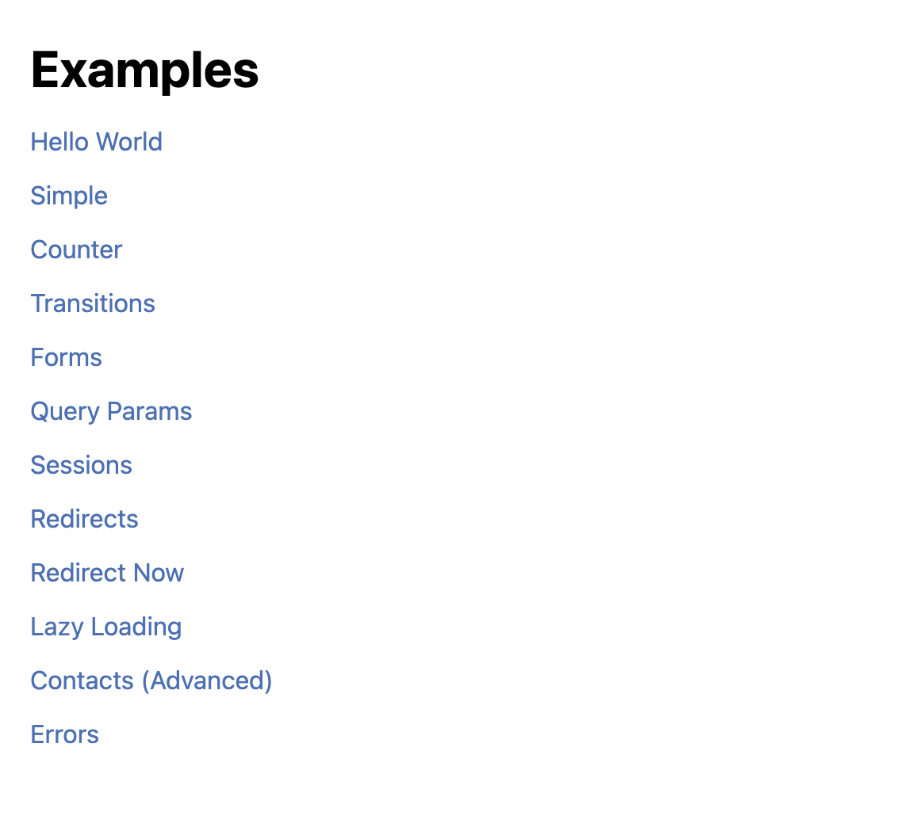
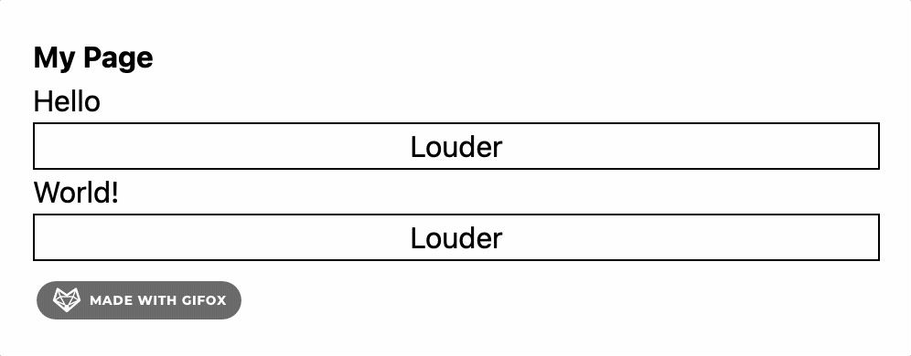
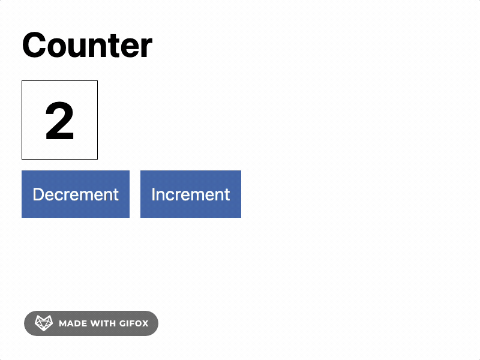
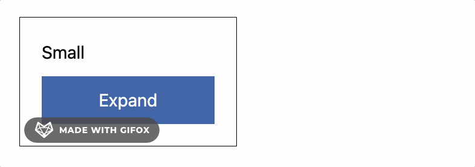
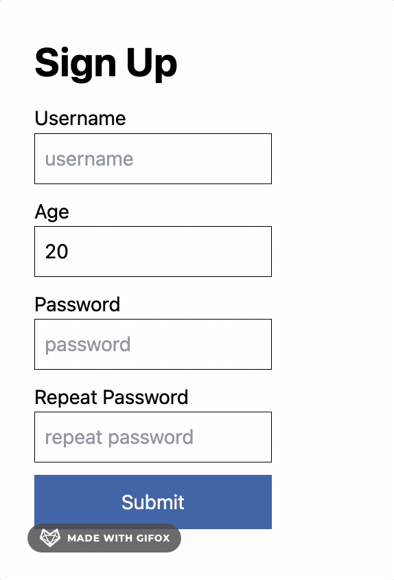
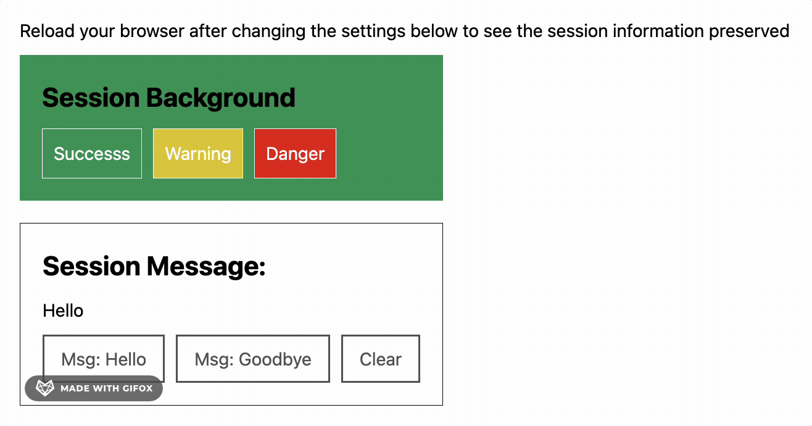
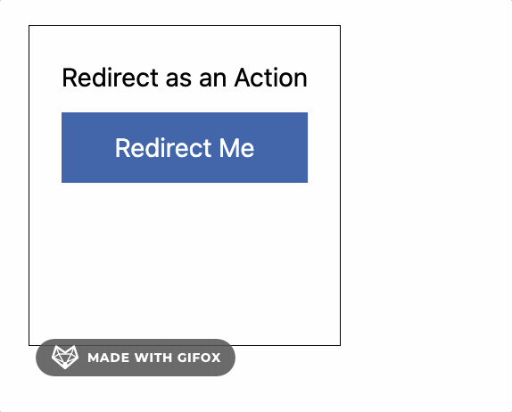
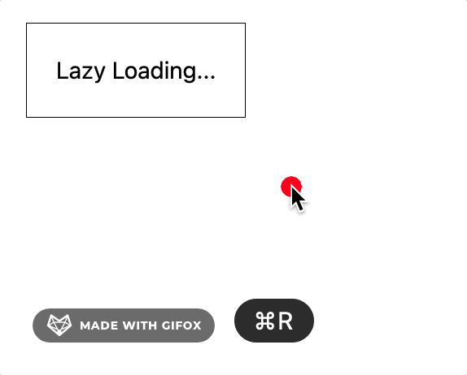
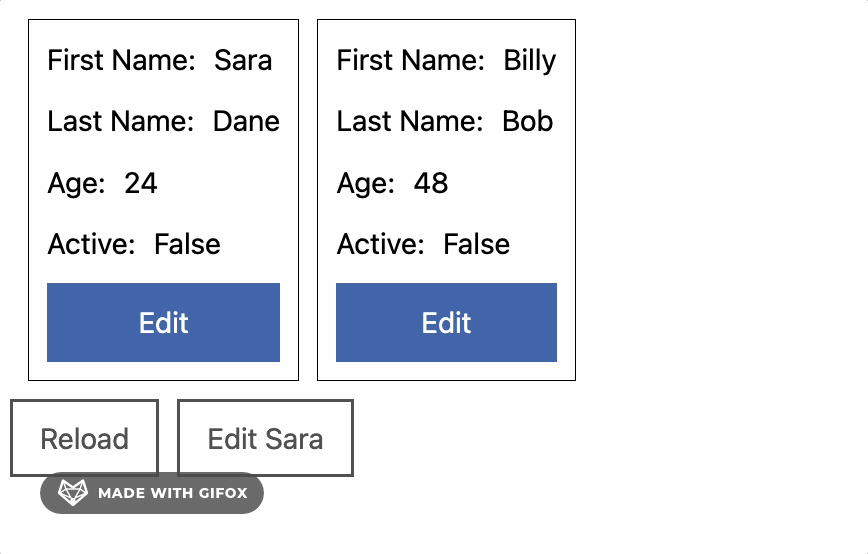

Hyperbole Examples
===================

This directory contains an example application with multiple pages demonstrating different features. To try them out:

1. Checkout the repository
2. Follow the [Local Development](https://github.com/seanhess/hyperbole#local-development) instructions
3. `cabal run examples`
4. visit http://localhost:3000/

Alternatively, create a new project that depends on hyperbole using cabal or stack and copy the examples into your source folder

### [Main](./Main.hs)
Routing, WAI application, running the program

### [Simple](./Example/Simple.hs)
Multiple HyperViews, Actions

### [Counter](./Example/Counter.hs)
Basics, State with a TVar

### [CSS Transitions](./Example/Transitions.hs)
Animate transitions using only CSS

### [Forms](./Example/Forms.hs)
Elegant interface for Forms including field-specific validation 

### [Sessions](./Example/Forms.hs)
store data on the client with a session

### [Redirects](./Example/Redirects.hs)
Redirecting to other pages. See Main as well

### [Lazy Loading and Polling](./Example/LazyLoading.hs)
Run an action after a delay for lazy loading or polling. See Main as well

### [Errors](./Example/Errors.hs)
Render server errors

### [Contacts (Advanced)](./Example/Contacts.hs)
Custom data effects, multiple views, targeting other views, loading indicators

